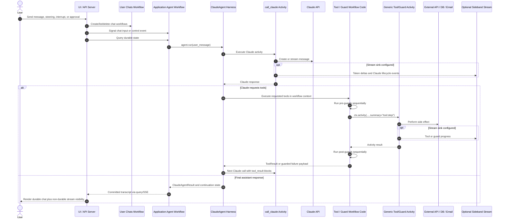

# Temporal Agent Harness Example

This repo is not trying to be a generic agent SDK.

It is an example of how a team might build a small, opinionated Claude harness around its own operating model: durable execution, readable Temporal history, explicit tool categories, runtime guard enforcement, controlled model access, resumable context, and optional non-durable streaming.

The interesting part is not "how to call an LLM." It is how the agent loop, tool registry, guard policy, context manager, and Temporal execution model fit together.

## Opinionated Architecture

The main design choice is to separate reusable harness behavior from application ownership. The harness should encode the agent platform rules a company wants every Claude agent to follow. The application still owns the workflow shape, product UX, authentication, tool availability, and business-specific policies.

| Layer | Owns | Does Not Own |
| --- | --- | --- |
| `claude_harness` | Claude request/response activities, the agent loop, context management, tool and guard registration, guard enforcement, generic activity routing, activity summary conventions, continuation snapshots, interrupt/steering semantics, and a streaming protocol. | Product auth, OAuth flows, UI state, user/session persistence, business workflows, concrete streaming transports, or provider-specific app state. |
| Application workflow | Durable conversation orchestration, signal/query/update surface, agent construction, tool availability, approval state, continue-as-new policy, and how returned harness state is carried forward. | Direct network I/O, UI rendering, or provider login flows. |
| Tools and guards | Business capabilities and policy. They run in workflow context, can call child workflows, wait on signals/timers, and use `ctx.activity(...)` for side effects. | Hidden side effects from workflow code. Durable side effects should go through activities or child workflows. |
| Activities | Non-deterministic work: Claude calls, API calls, database writes, emails, OAuth-token-backed provider calls, and long-running side effects. | Agent policy decisions that need to replay deterministically. |
| Worker process | Registration of workflows, activities, generic routers, data converter/codecs, and optional sideband stream sinks. | Per-user product state beyond what the application explicitly loads. |
| UI / API server | Login, OAuth, chat selection, signals, queries, event-stream display, and approval controls. | Durable agent memory or hidden changes to workflow state. |

This boundary is intentionally strict. For example, GitHub OAuth belongs to the simple chat application, not the harness. The workflow can receive a stable connection id or session id and let activities resolve the actual token. Passing a JWT or OAuth token through workflow history would make the wrong thing durable.

Sideband streaming follows the same rule. The harness defines a protocol and emits best-effort events when a sink is configured. The UI chooses how to transport and render those events. Partial streamed text is not durable conversation state until the Claude activity completes and the workflow commits the assistant message.

## Turn Flow



## What This Shows

- Agent loops can be ordinary Temporal workflow code.
- Claude calls can be isolated in one activity.
- Tool and guard code can run in workflow context while side effects route through generic activities.
- Tool categories can require pre-guards or post-guards at runtime.
- Event history can stay readable even when all tools share generic activity names.
- Context can be owned by the agent, snapshotted, restored, and reduced before each model call.
- Tool calls can run concurrently when Claude requests multiple tools in one turn.
- Users can steer or interrupt an in-progress agent without treating partial streamed text as durable state.
- Sideband streaming can provide best-effort product UX without coupling that stream to Temporal history.

## Core Shape

The Claude call is an activity. Tool execution happens from workflow code. If a tool needs side effects, it calls through `ctx.activity(...)`, which routes through a generic activity while setting a useful Temporal summary.

```python
from claude_harness.tool_types import ToolType
from claude_harness.tools import ToolContext, ToolResult, ToolSet, tool


@tool(
    name="lookup_customer",
    description="Look up a customer by id.",
    tool_type=ToolType.READ,
)
async def lookup_customer(ctx: ToolContext, customer_id: str) -> ToolResult:
    payload = await ctx.activity(
        _lookup_customer_activity,
        args={"customer_id": customer_id},
    )
    return ToolResult(payload=payload, error=False)


tools = ToolSet()
tools.add_tool(lookup_customer)
```

If no `step` is provided, the activity summary is the tool name:

```python
await ctx.activity(_lookup_customer_activity)
# summary: "lookup_customer"
```

If a tool has multiple activity steps, the tool author names them:

```python
await ctx.activity(_load_customer, step="load")
await ctx.activity(_update_customer, step="update")
# summaries: "lookup_customer:load", "lookup_customer:update"
```

This keeps the activity type generic while making Temporal history useful to humans.

## Registration

Tools and guards are defined with decorators and then added to a `ToolSet`. Standalone functions can be registered directly:

```python
tools.add_tool(lookup_customer, export_report)
tools.add_guard(require_ops_approval)
```

Provider classes can expose multiple related tools and guards while keeping shared API state in one object:

```python
class GitHubProvider:
    def __init__(self, connection_id: str) -> None:
        self._connection_id = connection_id

    @tool(
        name="github_list_issues",
        description="List issues in a GitHub repository.",
        tool_type=ToolType.READ,
    )
    async def list_issues(
        self, ctx: ToolContext, owner: str, repo: str
    ) -> ToolResult:
        payload = await ctx.activity(
            _list_issues_activity,
            args={
                "connection_id": self._connection_id,
                "owner": owner,
                "repo": repo,
            },
        )
        return ToolResult(payload=payload, error=False)


tools.add_provider(GitHubProvider(connection_id))
```

The model sees individual tools. The application can still group implementation state by provider.

## Activity Defaults

Agent construction is where the application sets normal activity behavior for tools and guards: task queues, timeouts, retry policy, cancellation behavior, and related Temporal options.

```python
from datetime import timedelta

from temporalio.common import RetryPolicy

from claude_harness.activity_options import ActivityOptions
from claude_harness.claude_agent import ClaudeAgent

agent = ClaudeAgent(
    "You are an internal operations agent.",
    tools,
    model="claude-sonnet-4-5",
    activity_options=ActivityOptions(
        schedule_to_start_timeout=timedelta(seconds=30),
        start_to_close_timeout=timedelta(minutes=5),
        retry_policy=RetryPolicy(maximum_attempts=3),
    ),
)
```

Tool and guard authors can override those defaults for a specific activity step:

```python
async def export_report(ctx: ToolContext, report_id: str) -> ToolResult:
    result = await ctx.activity(
        _export_report_activity,
        step="export",
        args={"report_id": report_id},
        start_to_close_timeout=timedelta(hours=1),
        retry_policy=RetryPolicy(maximum_attempts=1),
    )
    return ToolResult(payload=result, error=False)
```

The harness keeps the summary convention while allowing each step to use the Temporal execution policy it actually needs.

## Context And Continuation

The agent owns its context manager across `.run(...)` calls. A workflow can create the agent once, call it for each new user message, and preserve conversation context between turns.

```python
agent = ClaudeAgent(
    system_prompt,
    tools,
    model="claude-sonnet-4-5",
    max_tokens=64_000,
    max_context_tokens=200_000,
)

result = await agent.run(user_message, max_turns=20)
```

The default `SlidingWindowContextManager` keeps recent context, preserves the initial user message, removes stale tool-result blocks from older rounds, and fits the model input into a conservative token budget before each Claude call. The latest tool result is preserved in full for the next model call.

Applications can replace the context manager by passing `context_manager_factory=...`.

When Temporal suggests continue-as-new, the harness returns continuation state instead of continuing blindly:

```python
result = await agent.run(user_message)
if result.needs_continue_as_new:
    workflow.continue_as_new(
        AgentInput(agent_state=result.continuation_state)
    )
```

That state is a normal workflow payload. For large histories, use Temporal payload external storage, a codec, or an application database as the claim-check layer. The harness only defines the snapshot/restore contract.

## Steering And Interrupts

The workflow can add out-of-band user context without turning it into a brand-new task:

```python
agent.steer(
    "Prefer the safer remediation plan.",
    mode="after_next_tool_result",
)
```

`mode="immediate"` inserts steering before the next Claude call. `mode="after_next_tool_result"` inserts it after the next tool result is recorded.

Hard interrupts cancel the in-flight Claude activity and add replacement context:

```python
agent.interrupt("Stop that path. Check the customer's latest order first.")
```

The current policy discards partial assistant output. This matters when the UI streams tokens: streamed text is product UX, not durable conversation state, until the Claude activity completes.

## Sideband Streaming

The harness defines a small streaming protocol but does not own a transport. Applications install a sink in the worker process:

```python
from claude_harness.streaming import StreamEvent, configure_stream_sink


class JsonlSink:
    async def emit(self, event: StreamEvent) -> None:
        ...


configure_stream_sink(JsonlSink())
```

When a `stream_id` is supplied, Claude token deltas and tool activity progress can be emitted to that sink. Tool activities receive an injectable `StreamContext` only when they ask for it:

```python
from claude_harness.streaming import StreamContext


async def _export_report_activity(
    report_id: str,
    stream: StreamContext,
) -> dict[str, str]:
    await stream.emit({"report_id": report_id}, kind="export_started")
    ...
```

If no sink is configured, streaming is a no-op.

## Guards

Tools are categorized with `ToolType`. The harness can require guards for specific categories. Today, `ToolType.ADMIN` requires a pre-guard by default.

```python
from claude_harness.guards import GuardContext, GuardResult
from claude_harness.tool_types import ToolType
from claude_harness.tools import guard, tool


@guard(name="require_ops_approval", fulfills=ToolType.ADMIN)
async def require_ops_approval(ctx: GuardContext) -> GuardResult:
    approval = await ctx.activity(
        _request_ops_approval,
        step="approval",
        args={"tool_name": ctx.tool_name, "tool_args": ctx.tool_args},
    )

    if not approval["approved"]:
        return GuardResult(
            passed=False,
            reason="ops_approval_denied",
            llm_payload={
                "error": "Ops approval denied",
                "reason": "ops_approval_denied",
            },
        )

    return GuardResult(passed=True, internal_payload=approval)
```

The protected tool declares the guard explicitly:

```python
@tool(
    name="restart_service",
    description="Restart a production service.",
    tool_type=ToolType.ADMIN,
    pre_guards=[require_ops_approval],
)
async def restart_service(ctx: ToolContext, service_name: str) -> ToolResult:
    result = await ctx.activity(
        _restart_service,
        args={"service_name": service_name},
    )
    return ToolResult(payload=result, error=False)


tools.add_tool(restart_service)
```

Guards run sequentially in the order declared. Pre-guard failure prevents the tool from running. Post-guard failure prevents the model from receiving the raw tool result and returns the guard's `llm_payload` instead.

This does not make it impossible for a developer to write a bad guard. It does make missing guard coverage explicit and runtime-enforced.

## Reusable Guard Workflow Example

This example shows a reusable customer confirmation guard. `CUSTOMER_CHANGE` is an example company-specific tool category: the point is that a class of tools can require the same guard, while the guard chooses the right confirmation path from the tool context.

The customer confirmation workflow is reusable infrastructure:

```python
# workflows/customer_confirmation_workflow.py
import asyncio
from dataclasses import dataclass
from datetime import timedelta
from typing import Any, Literal

from temporalio import activity, workflow


ConfirmationStatus = Literal["accepted", "rejected", "timed_out"]


@dataclass
class CustomerConfirmationRequest:
    customer_email: str
    template: str
    payload: dict[str, Any]


@dataclass
class CustomerConfirmationEmail:
    message_id: str
    confirmation_workflow_id: str


@dataclass
class CustomerConfirmationResult:
    status: ConfirmationStatus
    accepted: bool
    email: CustomerConfirmationEmail


@activity.defn
async def send_customer_confirmation_email(
    request: CustomerConfirmationRequest,
    confirmation_workflow_id: str,
) -> CustomerConfirmationEmail:
    # The email should link to an app endpoint that signals
    # CustomerConfirmationWorkflow.confirm on this workflow id.
    # request.template selects the email template; request.payload fills it.
    return CustomerConfirmationEmail(
        message_id="email-message-id",
        confirmation_workflow_id=confirmation_workflow_id,
    )


@workflow.defn
class CustomerConfirmationWorkflow:
    def __init__(self) -> None:
        self._accepted: bool | None = None

    @workflow.signal
    async def confirm(self, accepted: bool) -> None:
        self._accepted = accepted

    @workflow.run
    async def run(
        self, request: CustomerConfirmationRequest
    ) -> CustomerConfirmationResult:
        confirmation_workflow_id = workflow.info().workflow_id
        email = await workflow.execute_activity(
            send_customer_confirmation_email,
            args=[request, confirmation_workflow_id],
            start_to_close_timeout=timedelta(minutes=1),
            summary=f"customer_confirmation:{request.template}",
        )

        try:
            await workflow.wait_condition(
                lambda: self._accepted is not None,
                timeout=timedelta(days=5),
                timeout_summary="customer_confirmation_timeout",
            )
        except asyncio.TimeoutError:
            return CustomerConfirmationResult(
                status="timed_out",
                accepted=False,
                email=email,
            )

        if not self._accepted:
            return CustomerConfirmationResult(
                status="rejected",
                accepted=False,
                email=email,
            )

        return CustomerConfirmationResult(
            status="accepted",
            accepted=True,
            email=email,
        )
```

The guard is reusable policy. It maps the current tool call to a confirmation template and starts the child workflow:

```python
# guards/customer_confirmation_guard.py
from dataclasses import asdict

from temporalio import workflow

with workflow.unsafe.imports_passed_through():
    from claude_harness.guards import GuardContext, GuardResult
    from claude_harness.tool_types import ToolType
    from claude_harness.tools import guard
    from my_agent.workflows.customer_confirmation_workflow import (
        CustomerConfirmationRequest,
        CustomerConfirmationWorkflow,
    )


def _customer_confirmation_request(ctx: GuardContext) -> CustomerConfirmationRequest:
    if ctx.tool_name == "substitute_item":
        return CustomerConfirmationRequest(
            customer_email=ctx.tool_args["customer_email"],
            template="substitute_item",
            payload={
                "order_id": ctx.tool_args["order_id"],
                "unavailable_sku": ctx.tool_args["unavailable_sku"],
                "substitute_sku": ctx.tool_args["substitute_sku"],
            },
        )

    if ctx.tool_name == "change_shipping_address":
        return CustomerConfirmationRequest(
            customer_email=ctx.tool_args["customer_email"],
            template="change_shipping_address",
            payload={
                "order_id": ctx.tool_args["order_id"],
                "new_address": ctx.tool_args["new_address"],
            },
        )

    raise ValueError(f"No customer confirmation configured for {ctx.tool_name}")


@guard(name="confirm_customer_change", fulfills=ToolType.CUSTOMER_CHANGE)
async def confirm_customer_change(ctx: GuardContext) -> GuardResult:
    request = _customer_confirmation_request(ctx)
    result = await workflow.execute_child_workflow(
        CustomerConfirmationWorkflow.run,
        request,
        id=f"{workflow.info().workflow_id}-{ctx.tool_name}-confirmation-{workflow.uuid4()}",
        static_summary=f"{ctx.guard_name}:{ctx.tool_name}",
    )

    if not result.accepted:
        return GuardResult(
            passed=False,
            reason=result.status,
            llm_payload={
                "error": "Customer did not approve the requested change.",
                "confirmation": asdict(result),
            },
        )

    return GuardResult(
        passed=True,
        internal_payload={"confirmation": asdict(result)},
    )
```

The tool stays focused on the actual mutation:

```python
# tools/substitute_item_tool.py
from datetime import timedelta

from claude_harness.tool_types import ToolType
from claude_harness.tools import ToolContext, ToolResult, tool
from my_agent.guards.customer_confirmation_guard import confirm_customer_change


async def _apply_substitution(
    order_id: str,
    unavailable_sku: str,
    substitute_sku: str,
) -> dict[str, str]:
    return {
        "order_id": order_id,
        "removed": unavailable_sku,
        "added": substitute_sku,
    }


@tool(
    name="substitute_item",
    description="Substitute an unavailable order item after customer confirmation.",
    tool_type=ToolType.CUSTOMER_CHANGE,
    pre_guards=[confirm_customer_change],
)
async def substitute_item(
    ctx: ToolContext,
    order_id: str,
    unavailable_sku: str,
    substitute_sku: str,
    customer_email: str,
) -> ToolResult:
    applied = await ctx.activity(
        _apply_substitution,
        step="apply_substitution",
        args={
            "order_id": order_id,
            "unavailable_sku": unavailable_sku,
            "substitute_sku": substitute_sku,
        },
        start_to_close_timeout=timedelta(minutes=2),
    )
    return ToolResult(
        payload={
            "substitution_applied": True,
            "applied": applied,
        },
        error=False,
    )
```

From Claude's point of view, `substitute_item` is one tool call. From the application's point of view, the reusable guard performs durable policy orchestration: a child workflow sends an email and waits for a customer signal or a five-day timer. The tool only runs after that guard passes, and its code is limited to the order mutation.

## Worker Registration

Applications using this harness should register the Claude activity plus the generic tool and guard routers:

```python
from claude_harness.claude_agent import call_claude
from claude_harness.guards import run_guard_activity
from claude_harness.tools import run_tool_activity
from my_agent.workflows.customer_confirmation_workflow import (
    CustomerConfirmationWorkflow,
    send_customer_confirmation_email,
)

activities = [
    call_claude,
    run_tool_activity,
    run_guard_activity,
    send_customer_confirmation_email,
]

workflows = [
    AgentWorkflow,
    CustomerConfirmationWorkflow,
]
```

The Anthropic SDK reads credentials from `ANTHROPIC_API_KEY`.

## What This Unlocks

Because tools and guards are workflow code, they can do more than call one function:

- Start child workflows for delegated work.
- Wait for durable approval flows, signals, updates, timers, or external state.
- Fan out to multiple activities and summarize each step clearly.
- Apply organization-specific guard policy before and after execution.
- Stream best-effort progress to a sideband sink when one is configured.
- Return continuation state when workflow history pressure requires continue-as-new.

That means examples in this repo should be read less as "agent demos" and more as "harness capability demos." The agent is the vehicle; the point is showing what the harness makes easy, observable, and harder to misuse.

## Non-Goals

- A provider-neutral agent framework.
- A complete authorization system.
- A replacement for application-specific workflows.
- A polished library API.
- A durable streaming system.

The goal is to make the architectural tradeoffs concrete enough that another team could adapt the pattern to its own internal agent platform.
